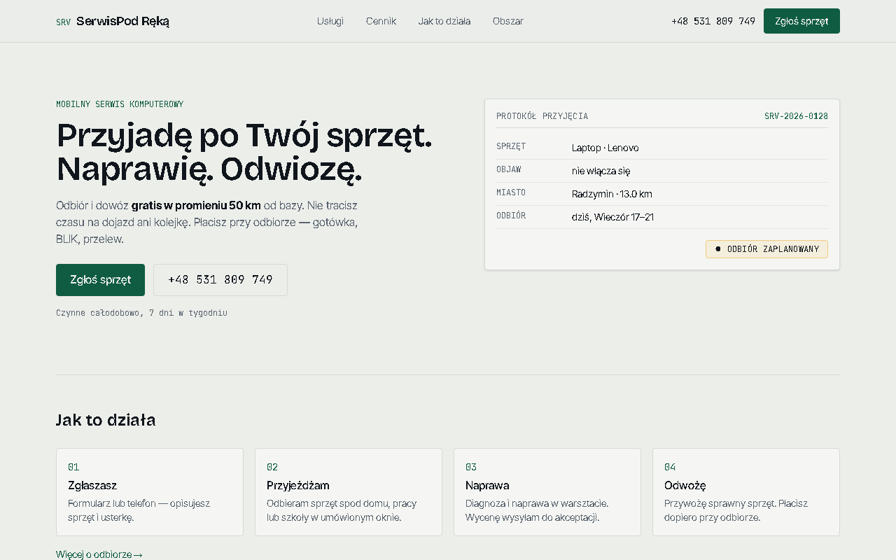
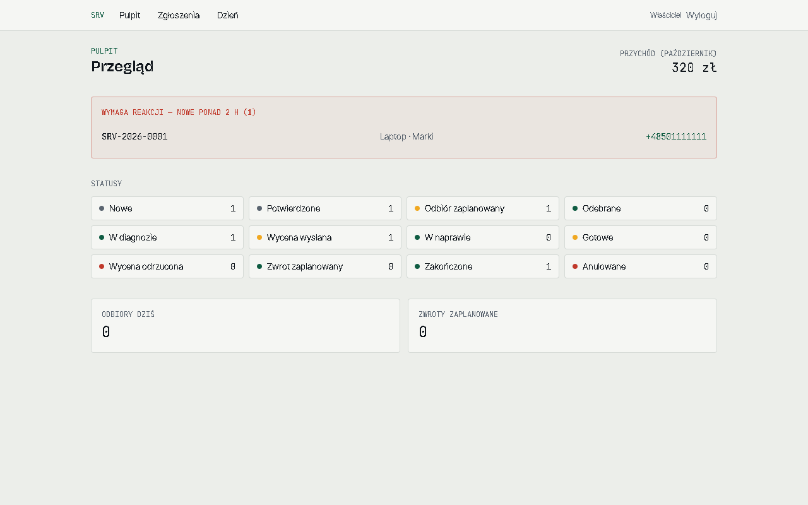
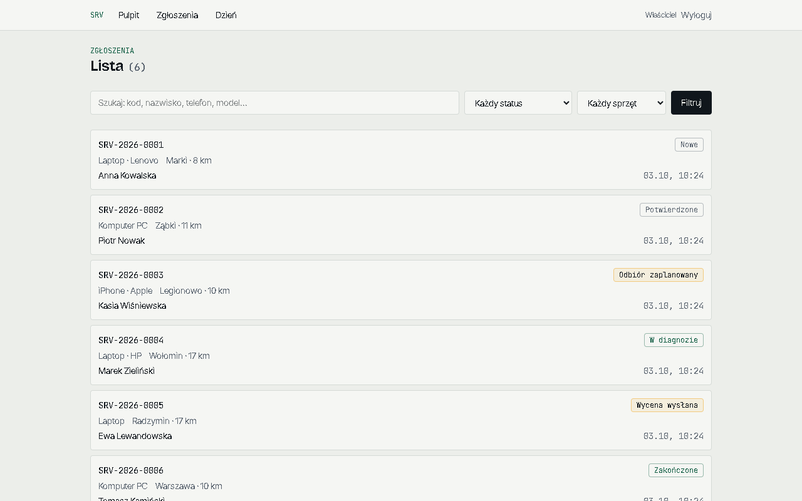

# repair-shop-app

Website and job tracking for a small mobile computer repair business in Warsaw. A customer
sends a repair request, I pick the device up, fix it in the workshop and bring it back.
This app covers everything in between.

**Demo:** https://serwis-pi.vercel.app (fake data). Admin panel at
[/panel/login](https://serwis-pi.vercel.app/panel/login), login `demo@serwis.demo`,
password `demo-panel-2026`. E-mail and Telegram are switched off in the demo.



| Admin dashboard | Ticket list |
|---|---|
|  |  |

## Features

- Public site: services, pricing, service area, one page per town. Generated statically from the database.
- Repair request form. Works without JavaScript; with JS it becomes a 4-step form.
- Admin panel: ticket list with search and filters, status changes, quotes, notes, a "today" view.
- Customers check their repair at `/status` with the ticket code and the last 4 digits of
  their phone number, and can accept or reject the quote there.
- New tickets go to my Telegram with buttons to confirm or schedule a pickup. Customers get
  e-mails at the steps that matter.

## Implementation notes

**Ticket states.** The lifecycle (new, confirmed, pickup scheduled, picked up, diagnosis,
quote sent, repair, ready, return scheduled, done, plus cancelled and quote rejected) lives in
`src/lib/ticket-state.ts` as plain functions. Every change goes through `canTransition()` and is
saved in the same transaction as a `ticket_event` row, so the history always matches the
current state. Moving to "quote sent" or "done" requires a price.

**One place for writes.** All mutations are in `src/services/`. The admin panel, the Telegram
webhook and the customer status page call the same functions.

**Auth.** Sessions table, httpOnly cookie, argon2. I didn't use Auth.js because its
credentials provider only supports JWT sessions in v5 and I wanted sessions I can revoke.

**Personal data.** IPs are only stored as salted SHA-256 hashes (for rate limiting). Row level
security is enabled with no policies, so the database's public REST API returns nothing. The
status page selects only the fields a customer should see. The lookup also takes the same
time whether the ticket exists or not.

**Spam.** Honeypot field, minimum time to fill the form, a rate limit stored in Postgres and
optional Cloudflare Turnstile.

**Distance.** Postal codes are mapped to coordinates from a local file and the distance from
the base is computed with haversine, so there's no external API call on form submit.

## Running locally

```bash
pnpm install
cp .env.example .env.local   # DATABASE_URL is the only required value
pnpm db:push
pnpm db:seed                 # services, towns, admin user, a few sample tickets
pnpm dev
```

Tests, lint and type check (also run in CI):

```bash
pnpm test
pnpm lint
pnpm exec tsc --noEmit
```

Resend, Telegram and Turnstile are optional. Without keys they are skipped.

## Stack

Next.js 16 (App Router), TypeScript, Tailwind CSS 4, Drizzle ORM, PostgreSQL, Zod, argon2,
Resend, Telegram Bot API, Vitest. The demo runs on Vercel with a Neon database.
[repair-shop-k8s-platform](https://github.com/faceitall123qwe-hub/repair-shop-k8s-platform) runs it on Kubernetes
with Argo CD, and [repair-shop-aws-terraform](https://github.com/faceitall123qwe-hub/repair-shop-aws-terraform) has a
Terraform setup for AWS.

Every push to `main` builds the container image, scans it with Trivy and signs it with cosign
(`.github/workflows/image.yml`); the Kubernetes platform only runs images signed this way.
