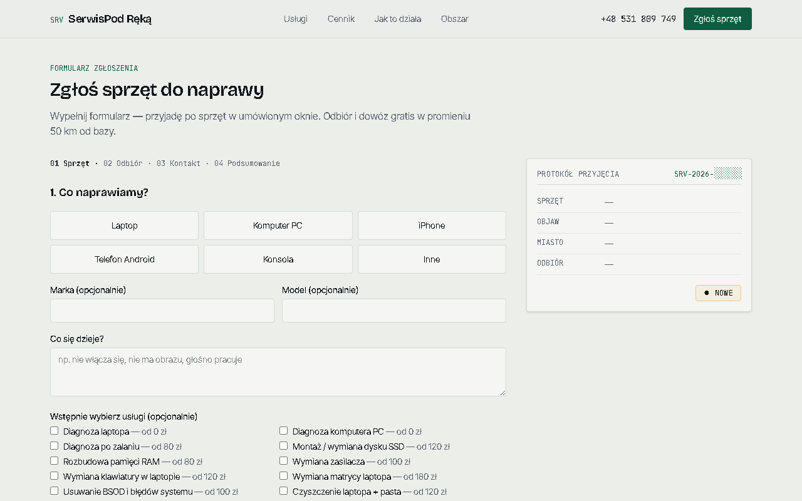
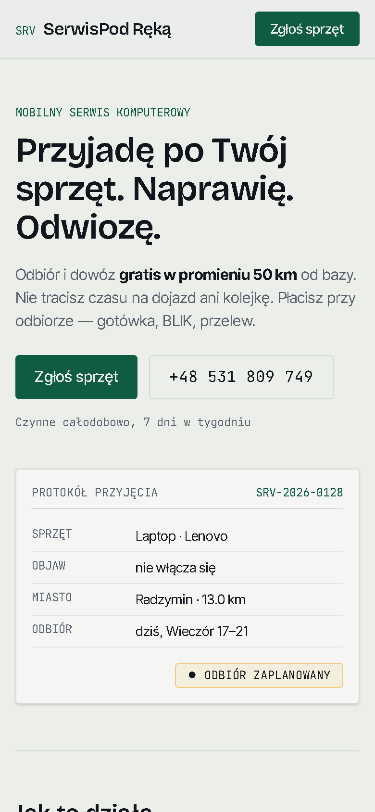
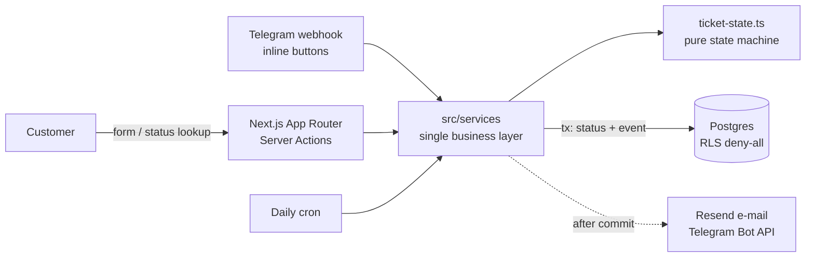
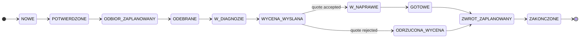

<div align="center">

# SerwisPod Ręką

**Full-stack platform for a mobile PC repair business — public site, repair tickets, admin panel, customer tracking.**

[](https://github.com/faceitall123qwe-hub/serwis/actions/workflows/ci.yml)


### [▶ Live demo](https://serwis-pi.vercel.app) · [Admin panel](https://serwis-pi.vercel.app/panel/login) · [AWS / Terraform version](https://github.com/faceitall123qwe-hub/serwis-infra)

<sub>Demo login: <code>demo@serwis.demo</code> / <code>demo-panel-2026</code> — all data is fictional; e-mail, Telegram and Turnstile are off.</sub>


</div>

---

## What it does

A one-person repair business picks devices up from customers, repairs them in a workshop
and brings them back. This app runs the whole flow:

1. **Customer** files a request (works with and without JavaScript) → gets a ticket code
2. **Owner** gets a Telegram message with inline buttons and manages the ticket in the panel
3. Every status change is logged; the customer is e-mailed at the steps that matter
4. **Customer** tracks the repair at `/status` and accepts or rejects the quote online

<table>
<tr>
<td width="50%"><p align="center"><sub>Admin dashboard</sub></p></td>
<td width="50%"><p align="center"><sub>Ticket list with filters</sub></p></td>
</tr>
<tr>
<td width="50%"><p align="center"><sub>Multi-step request form</sub></p></td>
<td width="50%" align="center"><p align="center"><sub>Mobile-first</sub></p></td>
</tr>
</table>

## Architecture



**Ticket lifecycle** — every transition goes through `canTransition()` and writes a
`ticket_event` in the same transaction; quote/close transitions require a price.


<sub>Any non-terminal state can also go to <code>ANULOWANE</code> (cancelled).</sub>

## Engineering highlights

| Area | What was done |
|---|---|
| **Domain logic** | Pure state machine, single service layer reused by UI, route handlers and the Telegram webhook — zero duplicated business rules |
| **Auth** | Own DB sessions + httpOnly/Secure/SameSite cookies + Argon2. Auth.js rejected on purpose: v5 credentials forces JWT, the design needed revocable sessions |
| **Privacy (GDPR / RODO)** | Raw IPs never stored (salted SHA-256), RLS deny-all on every table, explicit consent, tracking endpoint selects only customer-safe columns |
| **Abuse protection** | Honeypot, minimum fill time, optional Turnstile, sliding-window rate limit in Postgres (no Redis); status lookup has constant-time responses to avoid a timing oracle |
| **Service area** | Haversine distance from base via local postal-code dataset — no external API on the hot path |
| **SEO** | 24 service + 18 town pages prerendered (SSG), JSON-LD (`ComputerRepairService`, `FAQPage`, `BreadcrumbList`), sitemap |
| **Progressive enhancement** | Request form is a server-side form without JS and a 4-step wizard with JS |
| **Ops** | Vercel (fra1) + Neon for the demo; Dockerfile + OIDC deploy workflow for the [AWS stack](https://github.com/faceitall123qwe-hub/serwis-infra) |

## Tech stack

Next.js 16 (App Router) · React 19 · TypeScript strict · Tailwind v4 · Drizzle ORM · postgres.js ·
Zod · Argon2 · Resend + react-email · Telegram Bot API · Cloudflare Turnstile · Vitest · pnpm

## Run locally

```bash
pnpm install
cp .env.example .env.local     # only DATABASE_URL is required
pnpm db:push                   # create schema
pnpm db:seed                   # services, towns, admin (ADMIN_EMAIL/ADMIN_PASSWORD), sample tickets
pnpm dev                       # http://localhost:3000
```

```bash
pnpm test                      # state machine + distance unit tests
pnpm lint && pnpm exec tsc --noEmit
```

Optional integrations (Resend, Telegram, Turnstile) are skipped gracefully when their keys are empty.

## Project structure

```
src/
├── app/(public)/     public pages: services, pricing, area, request form, status tracking
├── app/(admin)/      admin panel (guarded layout + login)
├── app/api/          Telegram webhook, cron
├── services/         business logic — the only place that mutates data
├── lib/              state machine, auth, distance, validation (Zod), rate limit
├── db/               Drizzle schema + seed
└── emails/           react-email templates
```
